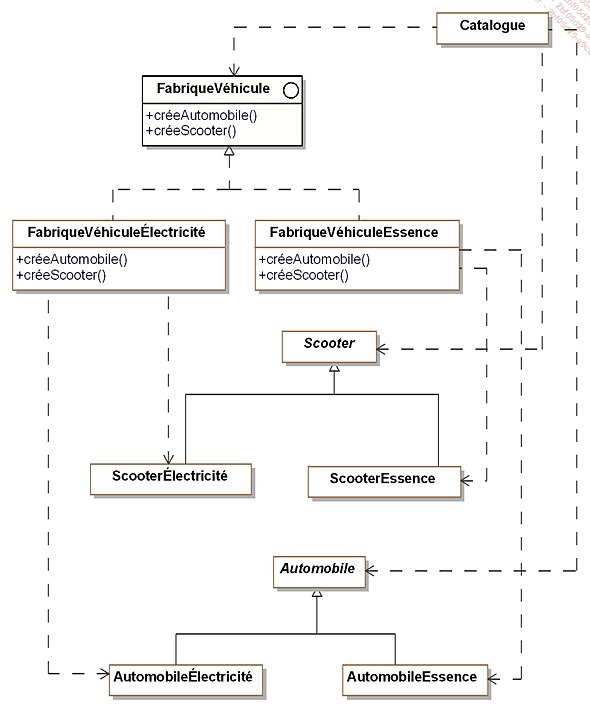

# Design Pattern  

  

## Description des patterns :  
  
- nom
- description
- exemple de code sous forme de diargramme UML
- la structure standard (abstraite)
- exemple de code  

## Cas concret d'étude pour ce cours

Nous allons prende en exemple le cas d'une société qui vend des véhicules en ligne.  

## Première grande famille de design pattern : les patterns de construction  

le but est de faire des wrapper autour de classe concrète et favorisé l'usage d'interface

single tone -> une classe une instance

### Le pattern Abstract Factory
le but de ce pattern est de permettre de fabriquer des objets regroupes en "famille" sans avoir a connaitre les classes cibles destinée à la fabrication de ces objets.

 

l'object cata prend en objet une instance de fabrique de Véhicule  

### Le pattern Builder 

Ce pattern permet d'abstraire la construction d'objets complexes de leur implementation de sorte qu'un client puisse creer des objets complexes sans avoir a se preocuper des differences d'implementation.

  

### Le pattern Factory Method

introduction d'une méthode abstraite pour l'instanciation d'objets.
En reportant l'implémentation à une sous-classe.

### Le pattern Singleton

Il faut s'assurer de deux choses : 

- Une classe ne doit posséder qu'une seule instance 
- Il faut fournir une methode de classe qui permet de fournir cette unique instance

### Le pattern Prototype

Le but de ce pattern est de creer de nouveaux objets en dupliquant des objets existants appeles "prototypes".
Ces derniers disposent d'une capacite de clonage.

https://medium.com/elp-2018/prototype-design-pattern-3bfc9f75ba24

## Introduction aux patterns de structuration

L’objectif des patterns de structuration est de faciliter l’indépendance de l’interface d’un objet ou d’un
ensemble d’objets vis-à-vis de son implantation.

https://jormes.developpez.com/articles/design-pattern-structuration/  

### Le pattern Adapter

Le but est d'adapter l'interface d'une classe donnée afin qu'elle puissent interagir avec un client.

https://blog.cellenza.com/developpement-specifique/le-design-pattern-adapter/

### Le pattern Decorator

Ajouter des fonctionnalités de ma manière dynamique à un objet.

Les nouvelles fonctionnalités de doivent pas changer l'interface de base.

Ce pattern est une alternative à la création d'une sous-classe.

Le pattern Decorator peut etre utilise dans les domaines suivants :
notre application souhaite ajouter dynamiquement des fonctionnalites a un objet sans modifier son interface autrement dit sans avoir a modifier les clients de cet objet
une application doit gerer des fonctionnalites qui peuvent etre retirees dynamiquement.
l'utilisation de l'heritage n'est pas une option car la hierarchie d'objets est deja trop complexe.

### Le Pattern Bridge

le principe d'ancapsuler complètement un objet dans un autre objet

https://refactoring.guru/fr/design-patterns/bridge

### Le pattern Composite

Unifie l'interface en utilisant la composition récursive.

https://refactoring.guru/fr/design-patterns/composite/java/example

## Les Patterns de comportement

### Pattern Chaine de responsabilité

TODO : Ajouter la définition

